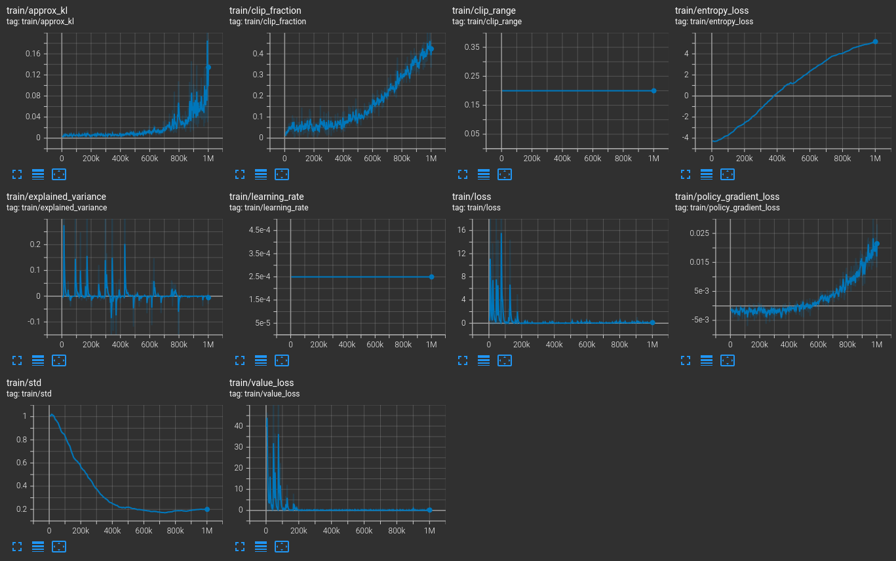
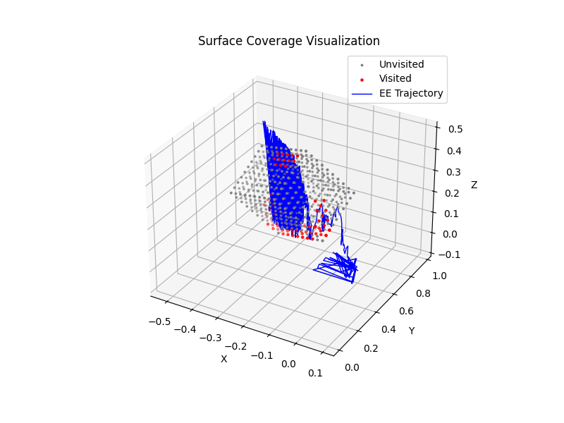
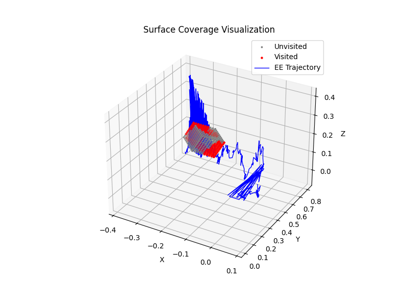
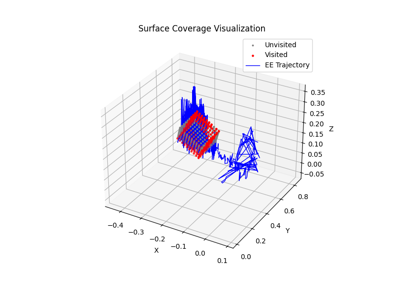
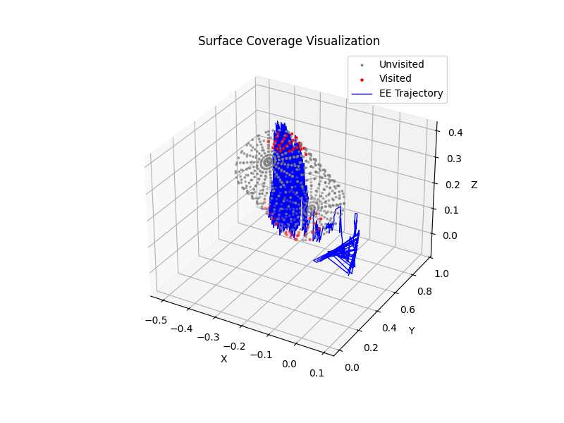
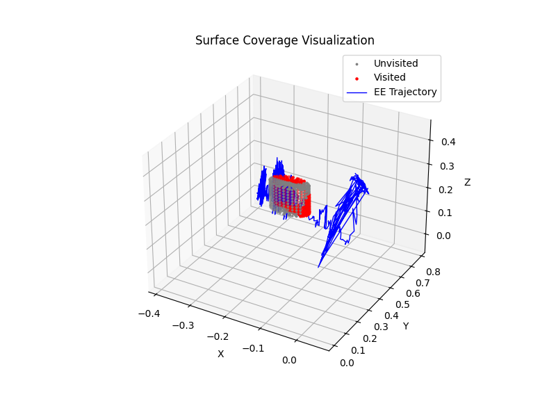

# Vision-Based Surface Tracing with Reinforcement Learning

This project aims to train a **fixed-mounted robot arm** (controlled via MoveIt) to perform **vision-based surface tracing** tasks on geometric objects like **cubes** and **cylinders** of varying **sizes** and **orientations**. The robot learns to trace the entire **reachable surface** using its end-effector.

## Method Overview

I adopt a reinforcement learning (RL) based pipeline using:

- **Stable-Baselines3 (SB3)** for training with PPO (Proximal Policy Optimization):
    SB3 is a set of reliable implementations of reinforcement learning algorithms in PyTorch.
    PPO is a widely used on-policy RL algorithm that offers a good balance between training stability and sample efficiency. It’s particularly suited for continuous control tasks like robot motion, where stable policy updates are critical to avoid erratic or unsafe actions.
- **panda-gym** to simulate a fixed-arm robot environment
- **Vision-based observations** are processed through a custom encoder combining CNN and spatial context via cross-modal fusion:
    The input image is passed through a CNN backbone, followed by a feature modulation module that incorporates a target 3D point (e.g., goal or contact point) into the image feature space. This design encourages the network to extract task-relevant geometric cues, enabling better generalization to unseen object poses and shapes.
- **Open3D** to load and manipulate point clouds of object surfaces

The robot is trained to maximize coverage of the surface while avoiding redundant or unreachable areas.

## Project Structure

```
vision_rl_surface_tracing/
│
├── env/                         # Custom Gym environment for surface tracing
│   ├── vision_surface_env.py    # Main Env
│   └── utils.py                 # PCD utils, surface sampling, reward
│
├── object/
│   ├── pcdMake.py               # Generate randomizable cube/cylinder PCDs
│   ├── train_pcds/              # Pre-generated PCDs for training
│   └── generated_pcds/          # Optionally auto-generated PCDs
│
├── models/                      # Stores trained PPO policy models (e.g., ppo_surface.zip)
│
├── motion_bridge/
│   └── bridge_rl_to_moveit.py   # Interface stub to integrate RL output with MoveIt
│
├── outputs/                     # Evaluation results, visualizations, CSV logs
│
├── ppo_surface_tensorboard/     # TensorBoard logs for PPO training
│
├── train.py                     # Main training script
├── evaluate.py                  # Evaluation + coverage computation
├── requirements.txt             # Python dependencies
└── README.md                    # Project instructions (this file)
```

## How to Use

### 1. Installation

```bash
conda create -n roborl python=3.9
conda activate roborl
pip install -r requirements.txt
```

### 2. Train the RL Policy

```bash
python train.py
```

- Trains a PPO policy using the point cloud observations in `object/train_pcds/`.

### 3. Visualize TensorBoard Training Logs

```bash
tensorboard --logdir=ppo_surface_tensorboard
```

- Navigate to `http://localhost:6006` in your browser.

- Example training curve:


### 4. Generate New Object Point Clouds

```bash
python object/pcdMake.py
```

- Supports random shape generation (`cube`, `cylinder`) with randomized size and rotation


### 5. Evaluate Trained Policy

```bash
python evaluate.py \
    --model_path models/ppo_surface.zip \
    --variant_dir object/generated_pcds \
    --output_csv outputs/eval_summary.csv
```

- `--model_path`: Path to trained `.zip` policy. Additionally, `models/ppo_surface_1M.zip` is our pre-trained model and can be used directly.
- `--variant_dir`: Folder containing test .pcd point clouds (e.g., cubes, cylinders of different sizes/orientations)
- `--output_csv`: Where to save the evaluation plots, results


## Example Result

The following are surface coverage visualizations generated during evaluation using the trained policy:

<table>
  <tr>
    <td></td>
    <td></td>
    <td></td>
  </tr>
  <tr>
    <td></td>
    <td></td>
    <td></td>
  </tr>
</table>

Each red region represents visited surface areas by the robot end-effector, while gray points remain uncovered. The blue line indicates the motion trajectory.

The policy achieves high coverage even across previously unseen object variations.

## TODO

- [ ] **Further Model Training**: The current model was trained under limited time and hardware constraints. Additional training is planned to improve generalization and robustness across object shapes and conditions.
- [ ] **Motion Execution**: `motion_bridge/bridge_rl_to_moveit.py` currently supports basic MoveIt execution by converting RL actions into Cartesian end-effector poses and executing them via MoveGroupCommander. However, integration with full motion planning is still pending due to time constraints.

